# Demo Guide

## 1. Clone the Argocon22 Demo Repository

```bash
git clone https://github.com/rcarrata/argocon22-securing-gitops-supply-chain.git
cd argocon22-securing-gitops-supply-chain
```

> This repository works both for OpenShift and all Kubernetes. If Kubernetes Vanilla is used follow first the [prerequisites guide](prereqs-k8s.md)

## 2. Install ArgoCD/OpenShift GitOps

* Install ArgoCD / OpenShift GitOps

```bash
until kubectl apply -k bootstrap/argocd/; do sleep 2; done
```

* After couple of minutes check the OpenShift GitOps and Pipelines:

```bash
ARGOCD_ROUTE=$(kubectl get route openshift-gitops-server -n openshift-gitops -o jsonpath='{.spec.host}{"\n"}')

curl -ks -o /dev/null -w "%{http_code}" https://$ARGOCD_ROUTE
```

## 3. Deploy prerequisites for the demo

* We will use ArgoCD to deploy all the components needed in this demo, for this reason, we will use Argo App of Apps pattern to deploy an ArgoApp that will deploy other ArgoCD Applications:

```bash
kubectl apply -f bootstrap/securing-gitops-demo-app.yaml
```

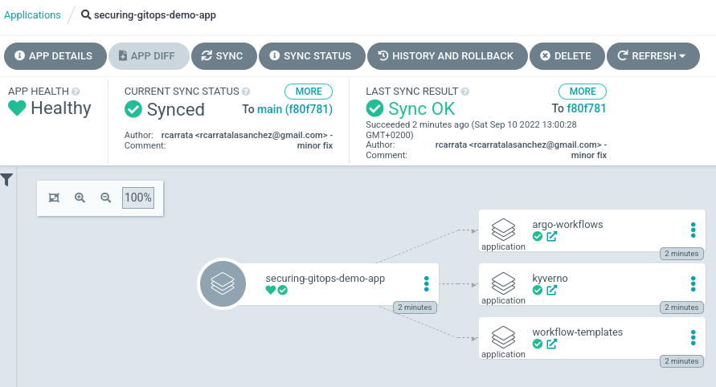

* The **Securing GitOps Demo App** Argo Application will deploy these sub Argo Applications using the Argo App of Apps pattern:

  1. **Argo Worflows** ArgoCD App:

  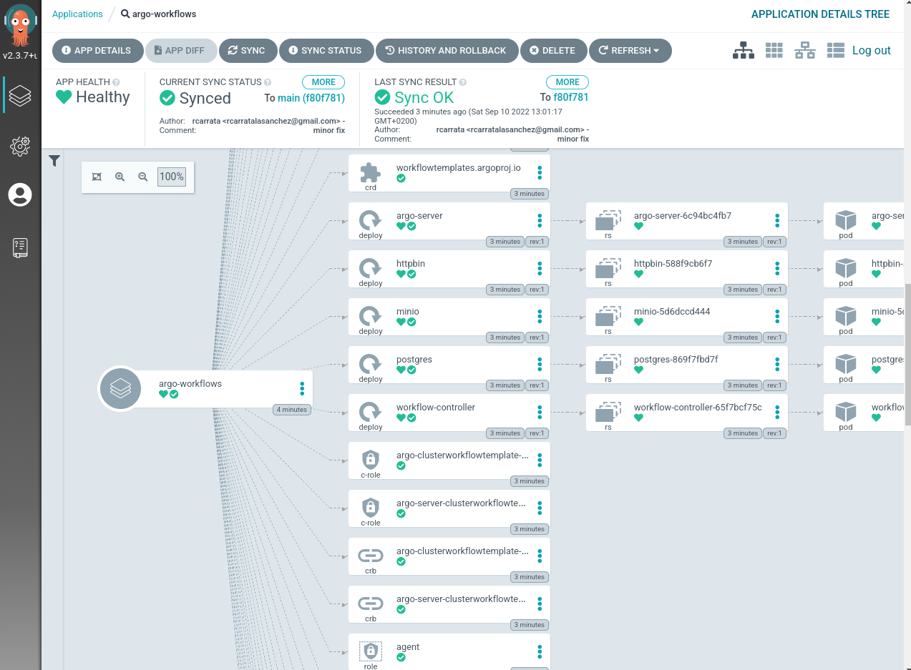

  2. **Kyverno** ArgoCD App:

  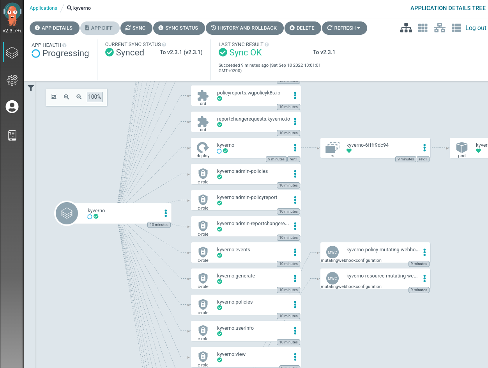

  3. **Argo Workflow Templates** ArgoCD App:

  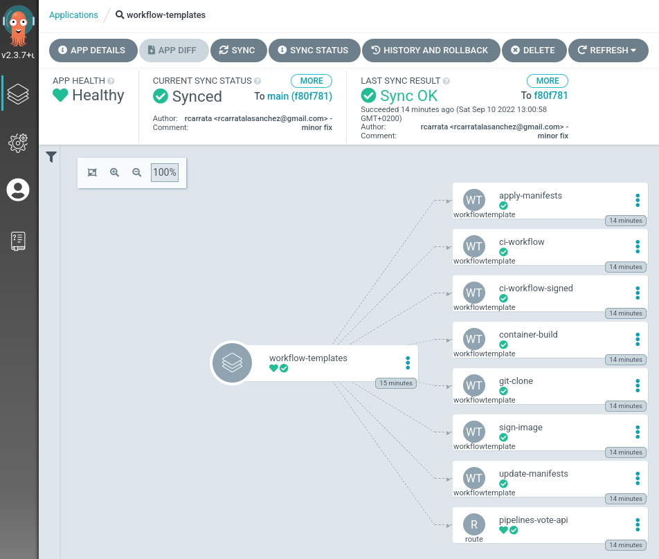

These three ArgoApps will create and deploy the prerequistes needed for running the demo, Argo Workflows, Kyverno and Argo Workflow Templates.

## 3. Add Github Registry Secrets

* Export the token for the GitHub Registry / ghcr.io:

```bash
export PAT_TOKEN="xxx"
export EMAIL="xxx"
export USERNAME="rcarrata"
export NAMESPACE="argo"
```

* Generate a docker-registry secret with the credentials for GitHub Registry to push/pull the images and signatures:

```bash
kubectl create secret docker-registry regcred --docker-server=ghcr.io --docker-username=${USERNAME} --docker-email=${EMAIL} --docker-password=${PAT_TOKEN} -n ${NAMESPACE}
```

## 4. Adding regcred to kyverno to read the signatures

* Generate in the Kyverno namespace the docker-registry secret with the credentials for GitHub Registry to push/pull the images and signatures:

```bash
kubectl create secret docker-registry regcred --docker-server=ghcr.io --docker-username=${USERNAME} --docker-email=${EMAIL} --docker-password=${PAT_TOKEN} -n kyverno
```

* Modify the Kyverno Deployment in order to include the imagePullSecret referencing the credentials for GitHub Registry to pull/push images and the signatures for check the images with Kyverno mutate Admission Controllers:

```bash
kubectl get deploy kyverno -n kyverno -o yaml | grep containers -A5
--
      containers:
      - args:
        - --imagePullSecrets=regcred
        env:
        - name: INIT_CONFIG
          value: kyverno
```

## 5. Configure RBAC for the Image Registry within Argo Workflows Namespace

* Add regcreds GH Registry to the Argo, and default serviceAccounts:

```bash
export NAMESPACE=argo
export SERVICE_ACCOUNT_NAME=argo
kubectl patch serviceaccount $SERVICE_ACCOUNT_NAME \
  -p "{\"imagePullSecrets\": [{\"name\": \"regcred\"}]}" -n $NAMESPACE
kubectl patch serviceaccount default \
 -p "{\"imagePullSecrets\": [{\"name\": \"regcred\"}]}" -n $NAMESPACE
```

## 6. Cosign Generate Key-Pairs

* Generate Cosign Key Pairs within the k8s/ocp cluster

```bash
cosign generate-key-pair k8s://${NAMESPACE}/cosign
```

## 7. Run Normal Pipeline

* Run a Argo Workflow for execute the CI Pipeline in a normal / regular usage way:

```bash
kubectl create -f run/securing-gitops-demo-workflow-normal.yaml
```

* Regular Pipeline for Build - Bake - Deploy

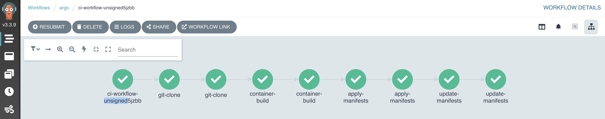

* GitHub Registry v1 App

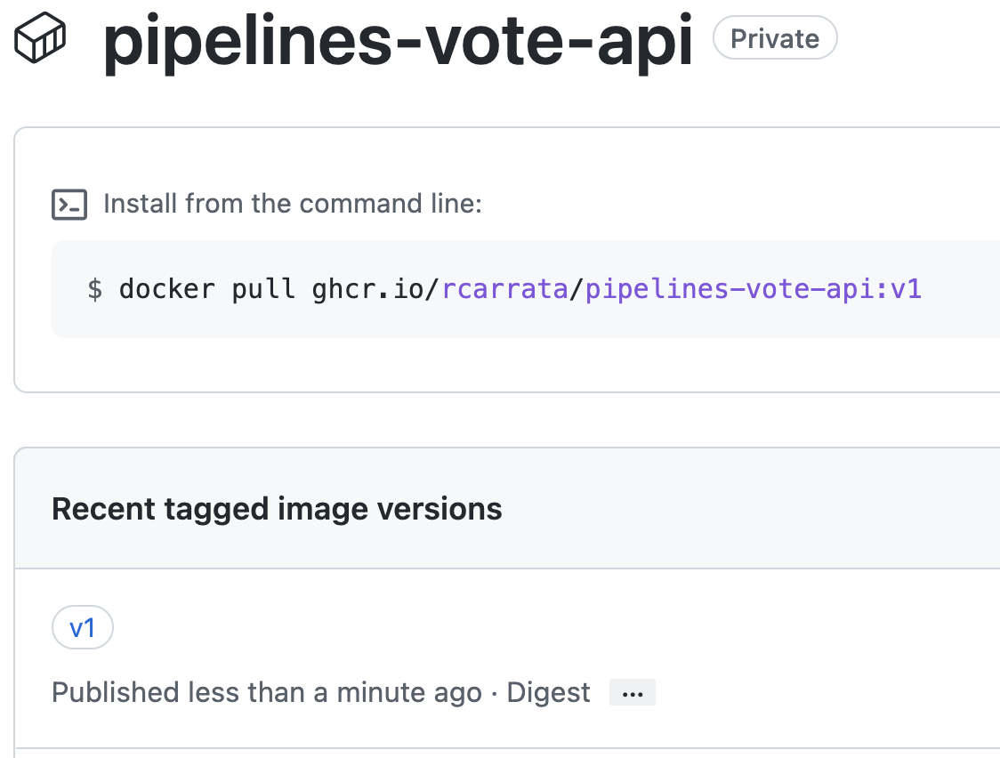

* App deployed successfully


## 8. Run the Hacked Pipeline

* Run a Argo Workflow for execute the CI Pipeline with a Hacked and vulnerabilities included:

```bash
kubectl create -f run/securing-gitops-demo-workflow-hacked.yaml
```

* Hacked Pipeline with App with Hacked Dockerfile and App

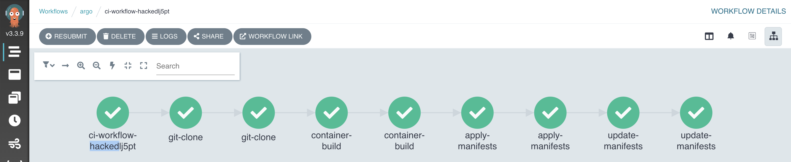

* Hacked Application running in the App


* GitHub Registry hacked App

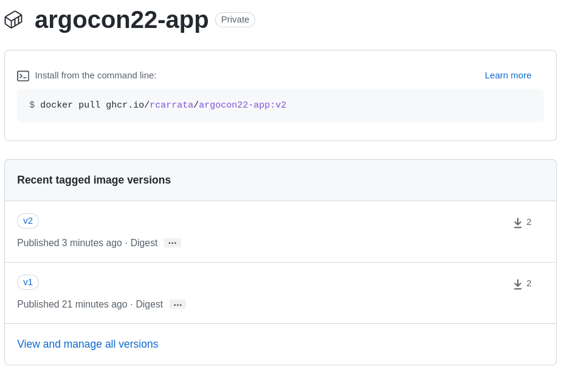

## 10. Deploy the Image Check Kyverno Cluster Policy

* Apply the Image Check Kyverno Cluster Policy for check images with pipelines-vote-api tags:

```bash
kubectl apply -k policy
```

* Check that the Cluster Policy for check-image from Kyverno is deployed properly:

```bash
kubectl get clusterpolicy check-image -n kyverno -o yaml
```

## 11. Run the Signed Pipeline

* Run a Argo Workflow for execute the CI Pipeline with sign steps and Kyverno verification:

```bash
kubectl create -f run/securing-gitops-demo-workflow-signed.yaml
```

* Signed Pipeline

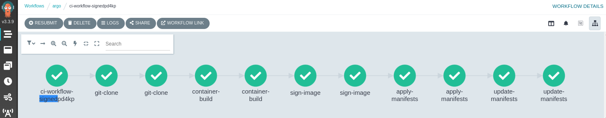

* Cosign Sign & Push Image signature

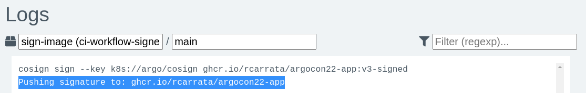

* GitHub Registry Signed App + Signature


## 12. Stopping to run the Hacked Pipeline with Kyverno

* Run a Argo Workflow for execute the CI Pipeline demonstrating how Kyverno stops the unsigned images:

```bash
kubectl create -f run/securing-gitops-demo-workflow-hacked.yaml
```

* Unsigned Pipeline

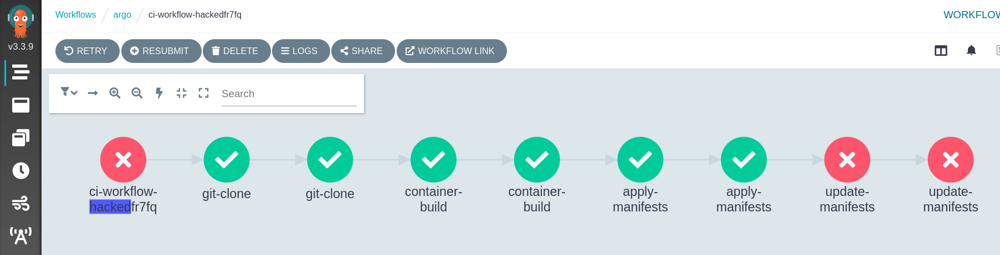

* Kyverno protects the cluster to deploy the hacked/unsigned image

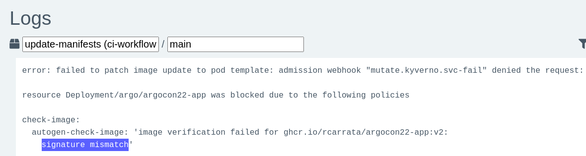

## 13. Adding Slack to Argo Notifications

```bash
https://github.com/argoproj/argo-workflows/blob/master/examples/exit-handler-slack.yaml
```
