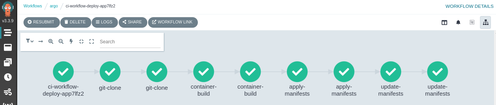
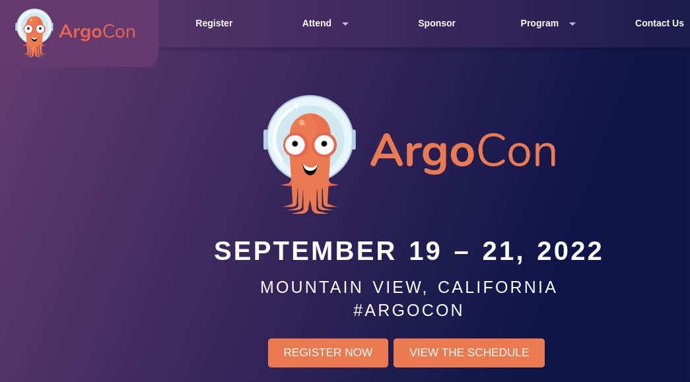
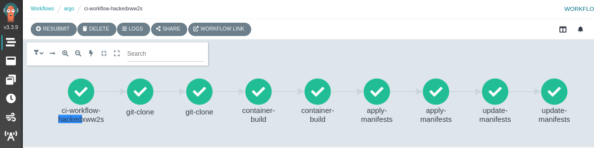

# Demo Guide

## 1. Clone the Argocon22 Demo Repository

```bash
git clone https://github.com/rcarrata/argocon22-securing-gitops-supply-chain.git
cd argocon22-securing-gitops-supply-chain
```

> This repository works for OpenShift and all other Kubernetes flavours. If you are using Vanilla Kubernetes, follow the [prerequisites guide](prereqs-k8s.md) first.

## 2. Install ArgoCD/OpenShift GitOps

* Install ArgoCD / OpenShift GitOps

```bash
until kubectl apply -k bootstrap/argocd/; do sleep 2; done
```

* After a few minutes, OpenShift GitOps and Pipelines will be ready. You can check this by running the following:

```bash
ARGOCD_ROUTE=$(kubectl get route openshift-gitops-server -n openshift-gitops -o jsonpath='{.spec.host}{"\n"}')

curl -ks -o /dev/null -w "%{http_code}" https://$ARGOCD_ROUTE
```

## 3. Deploy the prerequisites for the demo

* We are using use ArgoCD to deploy all the components needed in this demo. 
To do this, we are using Argo App of Apps pattern which deploys an ArgoApp that will then deploy the rest of our ArgoCD Applications:

```bash
kubectl apply -f bootstrap/securing-gitops-demo-app.yaml
```


* The Argo Application called **Securing GitOps Demo App**  will deploy the following sub Argo Applications using the Argo App of Apps pattern:

  1. **Argo Worflows** :
  <br/>
  
  <br/>
  2. **Kyverno** ArgoCD App:
  <br/>
  
  <br/>
  3. **Argo Workflow Templates** :
  <br/>
  


This deploys the prerequistes required for this demo.

## 3. Add Github Registry Secrets

* Export your [Github Personal Access Token](https://docs.github.com/en/enterprise-server@3.4/authentication/keeping-your-account-and-data-secure/creating-a-personal-access-token) for GitHub Registry/ghcr.io:

```bash
export PAT_TOKEN="xxx"
export EMAIL="xxx"
export USERNAME="rcarrata"
export NAMESPACE="argo"
```

* Generate a docker-registry secret with the credentials for GitHub Registry to push/pull the images and signatures:

```bash
kubectl create secret docker-registry regcred --docker-server=ghcr.io --docker-username=${USERNAME} --docker-email=${EMAIL} --docker-password=${PAT_TOKEN} -n ${NAMESPACE}
```

## 4. Adding regcred to kyverno 

This step is required in order to allow kyverno to access the signatures.

*  In Kyverno namespace, generate the docker-registry secret with the credentials for GitHub Registry to push/pull the images and signatures.

```bash
kubectl create secret docker-registry regcred --docker-server=ghcr.io --docker-username=${USERNAME} --docker-email=${EMAIL} --docker-password=${PAT_TOKEN} -n kyverno
```

* In order for the images to be pull/pushed and their signatures checked with Kyverno mutate Admission Controller, we need to include the imagePullSecret referencing the credentials for GitHub Registry. This is done by modifying the Kyverno Deployment and adding *imagePullSecrets=regcred* under *args* section in *containers*, the following shows what it should look like:

```bash
kubectl get deploy kyverno -n kyverno -o yaml | grep containers -A5
--
      containers:
      - args:
        - imagePullSecrets=regcred
        env:
        - name: INIT_CONFIG
          value: kyverno
```

To edit the deployment, you can use the following command:
```bash
 kubectl edit deploy kyverno -n kyverno -o yaml
```

## 5. Configure RBAC for the Image Registry within Argo Workflows Namespace

* Add regcreds GH Registry to Argo, and the default serviceAccounts:

```bash
export NAMESPACE=argo
export SERVICE_ACCOUNT_NAME=argo
kubectl patch serviceaccount $SERVICE_ACCOUNT_NAME \
  -p "{\"imagePullSecrets\": [{\"name\": \"regcred\"}]}" -n $NAMESPACE
kubectl patch serviceaccount default \
 -p "{\"imagePullSecrets\": [{\"name\": \"regcred\"}]}" -n $NAMESPACE
```

## 6. Generate Key-Pairs in Cosign

* Generate the Cosign Key Pairs in the k8s/ocp cluster.

```bash
cosign generate-key-pair k8s://${NAMESPACE}/cosign
```

## 7. Run the Unsigned Pipeline 

* Run an Argo Workflow to execute the CI Pipeline without signatures. 

```bash
kubectl create -f run/securing-gitops-demo-workflow-normal.yaml
```

* Regular Pipeline to Build - Bake - Deploy



* GitHub Registry v1 App


* App deployed successfully



## 8. Run the Hacked Pipeline

* Run an Argo Workflow to execute the CI Pipeline with the vulnerability. 

```bash
kubectl create -f run/securing-gitops-demo-workflow-hacked.yaml
```

* Hacked Pipeline with App with Hacked Dockerfile and App



* Hacked Application running in the App


* GitHub Registry hacked App


## 10. Deploy the Image Check Kyverno Cluster Policy

* Apply the Image Check Kyverno Cluster Policy to check images with a tag called pipelines-vote-api:

```bash
kubectl apply -k policy
```

* Check that the Cluster Policy for check-image from Kyverno is deployed properly:

```bash
kubectl get clusterpolicy check-image -n kyverno -o yaml
```

## 11. Run the Signed Pipeline

* Run a Argo Workflow for execute the CI Pipeline with sign steps and Kyverno verification:

```bash
kubectl create -f run/securing-gitops-demo-workflow-signed.yaml
```

* Signed Pipeline


* Cosign Sign & Push Image signature


* GitHub Registry Signed App + Signature


## 12. Stopping to run the Hacked Pipeline with Kyverno

* Run an Argo Workflow to execute the CI Pipeline to demonstrate how Kyverno stops the unsigned images:

```bash
kubectl create -f run/securing-gitops-demo-workflow-hacked.yaml
```

* Unsigned Pipeline


* Kyverno protects the cluster to deploy the hacked/unsigned image:


## 13. Stopping to run a Hacked ArgoCD Application

Let's see how we can prevent to deploy a hacked image using ArgoCD application and Kyverno.

* Kyverno can also stop Hacked ArgoCD application that syncs with k8s deployments that uses unsigned container images from the registry:

```bash
kubectl apply -f run/securing-gitops-demo-argocd-hacked.yaml
```

* Kyverno denies the request because the container image that is defined in the repository within the k8s Deployment, is not signed with the proper cosign key:


* As we can check, the Admission Controller from Kyverno, denied the request to deploy the application with the hacked container image because the signature mismatch after compare with the public key within the check-image from Kyverno:


## 14. Cleaning the demo

* Clean the resources in the argo namespace:

```bash
kubectl delete -f run/securing-gitops-demo-argocd-hacked.yaml
kubectl delete -k policy/

kubectl -n ${NAMESPACE} delete deployment argocon22-app 
kubectl -n ${NAMESPACE} delete svc argocon22-app 

for i in $(kubectl get pod -n ${NAMESPACE} --no-headers | grep -v Running | awk '{ print $1 }'); do kubectl delete pod $i -n ${NAMESPACE}; done

kubectl delete -n ${NAMESPACE} workflow --all
```

* Delete the container image repository in the [GitHub registry](https://github.com/users/rcarrata/packages/container/argocon22-app/settings).
