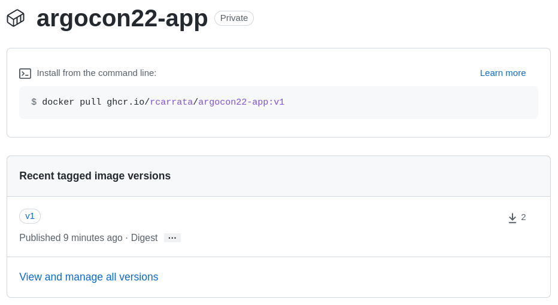
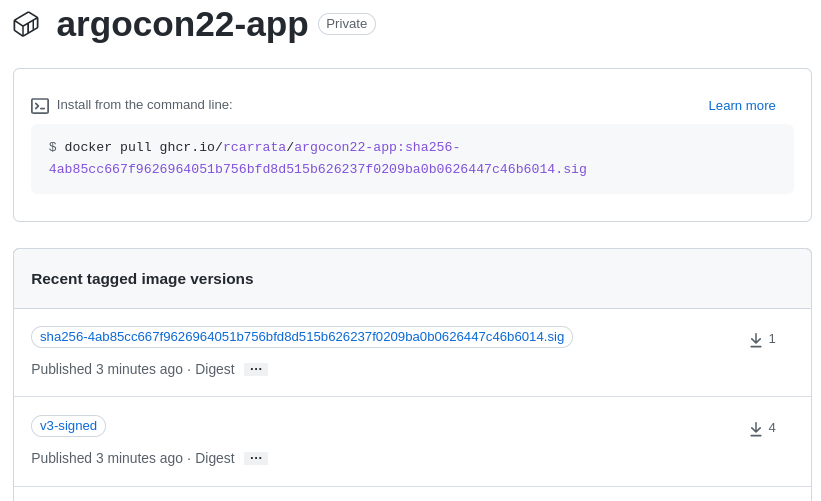

## Pre Requisites for run the demo in OpenShift

## Clone the GitHub

```sh
git clone https://github.com/rcarrata/argocon22-securing-gitops-supply-chain.git
cd argocon22-securing-gitops-supply-chain
```

## Install ArgoCD / OpenShift GitOps:

* Install ArgoCD / OpenShift GitOps

```sh
until kubectl apply -k bootstrap/argocd/; do sleep 2; done
```

* After couple of minutes check the OpenShift GitOps and Pipelines:

```sh
ARGOCD_ROUTE=$(kubectl get route openshift-gitops-server -n openshift-gitops -o jsonpath='{.spec.host}{"\n"}')

curl -ks -o /dev/null -w "%{http_code}" https://$ARGOCD_ROUTE
```

## Add Github Registry Secrets

* Export the token for the GitHub Registry / ghcr.io:

```bash
export PAT_TOKEN="xxx"
export EMAIL="xxx"
export USERNAME="rcarrata"
export NAMESPACE="argo"
```

* Generate a docker-registry secret with the credentials for GitHub Registry to push/pull the images and signatures:

```bash
kubectl create secret docker-registry regcred --docker-server=ghcr.io --docker-username=${USERNAME} --docker-email=${EMAIL} --docker-password=${PAT_TOKEN} -n ${NAMESPACE}
```

## Adding regcred to kyverno to read the signatures

```
kubectl get deploy kyverno -n kyverno -o yaml | grep containers -A5
--
      containers:
      - args:
        - --imagePullSecrets=regcred
        env:
        - name: INIT_CONFIG
          value: kyverno
```

```
kubectl create secret docker-registry regcred --docker-server=ghcr.io --docker-username=${USERNAME} --docker-email=${EMAIL} --docker-password=${PAT_TOKEN} -n kyverno
```

## Add regcreds to the pullsecret

```
export NAMESPACE=argo
export SERVICE_ACCOUNT_NAME=argo
kubectl patch serviceaccount $SERVICE_ACCOUNT_NAME \
  -p "{\"imagePullSecrets\": [{\"name\": \"regcred\"}]}" -n $NAMESPACE
kubectl patch serviceaccount default \
 -p "{\"imagePullSecrets\": [{\"name\": \"regcred\"}]}" -n $NAMESPACE
```

## Cosign Generate Key-Pairs

```sh
cosign generate-key-pair k8s://${NAMESPACE}/cosign


```

## Run Normal Pipeline

```sh
kubectl create -f run/securing-gitops-demo-workflow-normal.yaml
```

* Regular Pipeline for Build - Bake - Deploy


* GitHub Registry v1 App




## Run the Hacked Pipeline

```sh
kubectl create -f run/securing-gitops-demo-workflow-hacked.yaml
```

* Hacked Pipeline with App with Hacked Dockerfile and App


* Hacked Application running in the App


* GitHub Registry hacked App


## Deploy the Image Check Kyverno Cluster Policy

```sh
kubectl apply -k policy
```

## Run the Signed Pipeline

```sh
kubectl create -f securing-gitops-demo-workflow-signed.yaml
```

* Signed Pipeline


* Cosign Sign & Push Image signature


* GitHub Registry Signed App + Signature



## Run the Unsigned Pipeline

```sh
kubectl create -f run/securing-gitops-demo-workflow-unsigned.yaml
```

* Unsigned Pipeline


* Kyverno protects the Pipeline to be deployed


## Adding Slack to Argo Notifications

```
https://github.com/argoproj/argo-workflows/blob/master/examples/exit-handler-slack.yaml
```